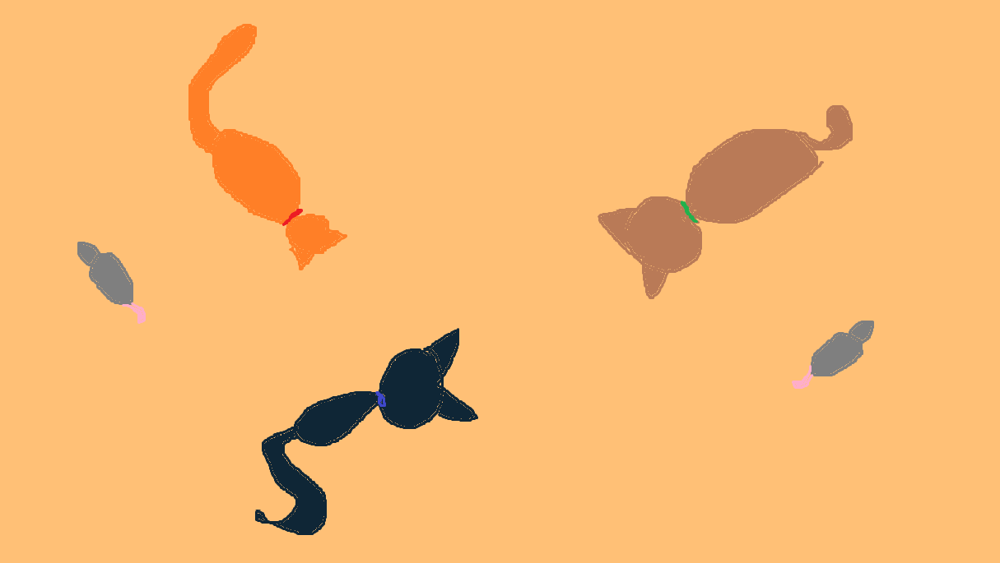
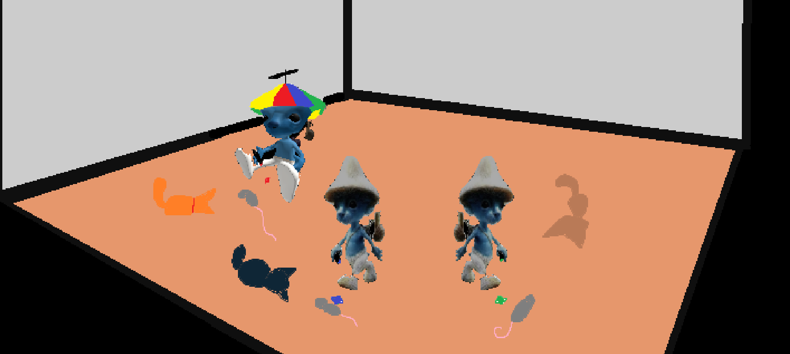
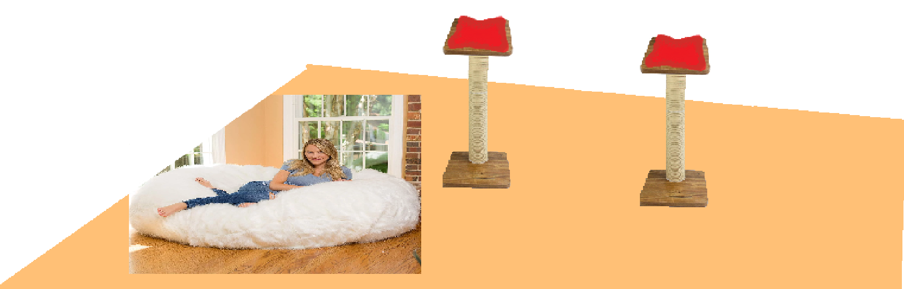
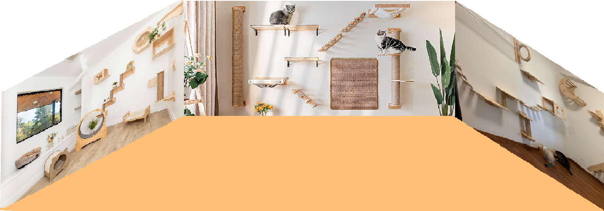
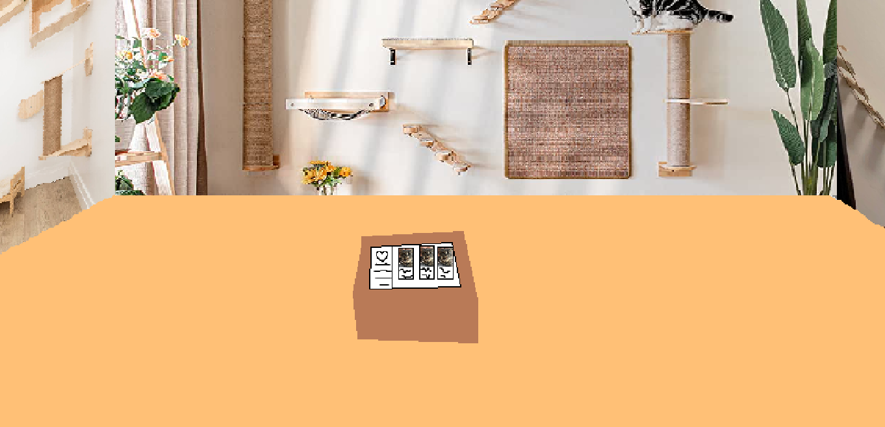
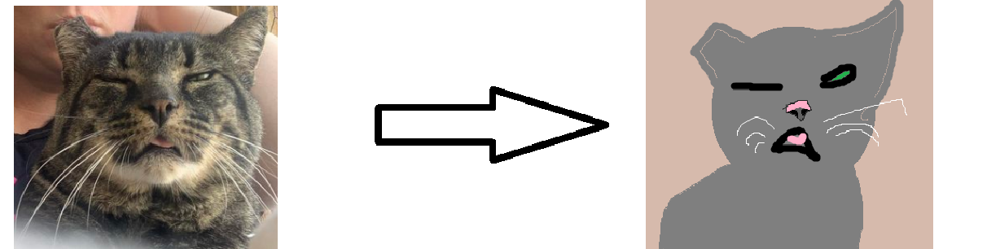

[:) yippie](https://jasmine-lapierre.github.io/Presentation-Ideation/#/)
Le sujet de ma présentation est une salle interactive conçue en collaboration avec un refuge pour chats local. Cette initiative combine la technologie interactive et une cause noble, celle de promouvoir l'adoption de chats provenant du refuge. Ce projet comporte deux aspects qui se mêlent pour créer une ambiance immersive.

# Aspect 1 : Sol interactif avec jeu pour chats guidé par des lasers

**Projections réelles** : Des projections réelles de chats et de souris animent le sol, créant un environnement ludique.

**Interaction au laser** : Les participants utilisent des pointeurs laser pour guider les chats vers les souris. Chaque laser, identifié par une couleur différente, contrôle une race de chat spécifique, transformant ainsi cette expérience en une aventure interactive.

**Intégration Kinect** : Un capteur Kinect monté au plafond suit les positions colorimétriques des lasers (vert, bleu et rouge) et les communique à un ordinateur, créant une interaction inédite entre les visiteurs et les chats.

**Confort** : Des sièges cylindriques équipés de coussins et de grattoirs pour chats ainsi que des poufs moelleux, ressemblant à des lits pour chats, sont dispersés dans la salle.

# Aspect 2 : Informations sur l'adoption de chats et histoires

**Animations projetées** : Trois projecteurs au plafond diffusent des animations 2D de chats vaquant à leurs occupations quotidiennes dans une grande salle virtuelle pour chats, créant une atmosphère immersive.

**Tablette interactive** : Au centre de la pièce, un podium renferme une tablette interactive. Les visiteurs peuvent y consulter des descriptions de vrais chats du refuge, chaque description étant accompagnée d'une image.

**Histoires de chats** : Lorsqu'un visiteur touche la description du chat, l'image du chat apparaît sur le mur de devant. Cette image se transforme ensuite en une représentation 2D du chat, accompagnée d'une brève histoire de sa vie, y compris les circonstances de son abandon.

**Expérience sonore** : Une narration audio de l'histoire du chat est diffusée à travers plusieurs haut-parleurs répartis dans la salle. Des sons ambiants, tels que des coups de klaxon, des ronronnements et des miaulements, ajoutent à l'immersion.

En résumé, ce projet de salle interactive mêle technologie, narration et expériences sensorielles pour promouvoir l'adoption de chats tout en offrant une expérience divertissante et instructive à nos visiteurs. Il vise à établir un lien unique entre les futurs adoptants et les chats en quête de foyers aimants, tout en offrant une expérience agréable et inoubliable pour tous.

